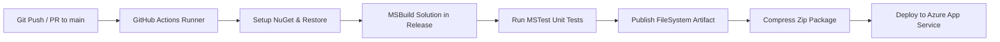

# 🪺 JobNest — Modern Recruitment & Job Discovery Platform

[](https://github.com/muxdaslam-sys/JobNest/actions/workflows/build-test-deploy.yml)


[](https://jobnest-e8gwccfzgmgbdthe.southindia-01.azurewebsites.net/)
[](https://jobnest-e8gwccfzgmgbdthe.southindia-01.azurewebsites.net/)

> **JobNest** is a full-stack, enterprise-grade job portal and recruitment management platform engineered with **ASP.NET MVC 5**, **C#**, **Entity Framework 6**, and **Microsoft SQL Server**. It provides seamless, dual-role workflows tailored for job seekers and hiring managers, accompanied by an automated **GitHub Actions CI/CD** pipeline deploying directly to **Microsoft Azure App Service**.
>
> 🌐 **Live URL**: [https://jobnest-e8gwccfzgmgbdthe.southindia-01.azurewebsites.net](https://jobnest-e8gwccfzgmgbdthe.southindia-01.azurewebsites.net/)

---

## 📌 Table of Contents

- [Overview](#-overview)
- [Key Features](#-key-features)
  - [For Job Seekers (Candidates)](#-for-job-seekers-candidates)
  - [For Employers (Recruiters)](#-for-employers-recruiters)
- [Design System & UI/UX](#-design-system--uiux)
- [Architecture & Tech Stack](#-architecture--tech-stack)
- [Database Schema & Stored Procedures](#-database-schema--stored-procedures)
- [CI/CD Pipeline & Cloud Deployment](#-cicd-pipeline--cloud-deployment)
- [Project Structure](#-project-structure)
- [Getting Started & Local Setup](#-getting-started--local-setup)
- [Automated Testing](#-automated-testing)
- [Security & Optimization](#-security--optimization)
- [Author & Acknowledgments](#-author--acknowledgments)

---

## 🌟 Overview

Finding the right career opportunity or the ideal candidate requires speed, clarity, and reliability. **JobNest** bridges the gap between ambitious talent and top-tier recruiters with a streamlined, high-performance web platform inspired by modern industry leaders like Naukri.com.

Featuring role-adaptive authentication, intelligent job filtering, real-time candidate pipeline updates, and hardened file handling for resumes, JobNest provides an end-to-end recruitment experience from vacancy creation to offer acceptance.

---

## 🚀 Key Features

### 👨‍💻 For Job Seekers (Candidates)

- **Interactive Portal & Role Theming**: Dedicated Candidate portal with a calm, focused emerald theme.
- **Rich Candidate Profile**: Register with personal details, experience, qualifications, core skillsets, and profile photos.
- **Smart Job Search & Multi-Filtering**:
  - Filter jobs dynamically by Job Title, Required Skills, or Company Name.
  - Filter by maximum experience requirements.
  - Filter by target job location.
- **One-Click Job Applications**: Apply directly with a single click, upload resumes (`.pdf`, `.doc`, `.docx` up to 10MB), and avoid accidental duplicate submissions.
- **Real-Time Application Tracking**:
  - Live status dashboard tracking applications across review stages: `Applied`, `Shortlisted`, `Interview Scheduled`, `Rejected`, `Hired`.
  - Preview and redownload submitted resume files.

### 🏢 For Employers (Recruiters)

- **Enterprise Registration & Authentication**: Distinct corporate onboarding with instant validations preventing duplicate company names or usernames.
- **Job Posting Lifecycle Management**:
  - Create and publish comprehensive job openings (title, required experience, skill tags, qualifications, compensation/salary, and auto-managed 30-day expiry windows).
  - Activate, pause, or view all active postings from a consolidated recruiter console.
- **Applicant Pipeline & Candidate Review**:
  - View all candidates who applied for any posted job vacancy.
  - Inspect candidate contact details, experience level, skill tags, and profile photo.
  - Download and review submitted applicant resumes.
- **Instant AJAX Status Progression**:
  - Update candidate application status (`Shortlisted`, `Hired`, `Rejected`, etc.) without refreshing the page.
  - Built-in ownership checks ensuring recruiters can only modify applications belonging to their own company postings.

---

## 🎨 Design System & UI/UX

JobNest features a custom, modern UI inspired by top job boards:

- **Adaptive Split-Screen Authentication**: Dynamic 50/50 split authentication screen with instant role toggle (Candidate emerald vs. Recruiter royal blue).
- **Zero-Scroll Balanced Forms**: High conversion, ergonomic registration layouts designed to fit modern screens without visual clutter.
- **Typography & Icons**: Inter typeface paired with FontAwesome 6 icons.
- **Micro-Interactions**: Hover elevations, pill status tags, glassmorphism headers, and smooth modal overlays.

---

## 🛠 Architecture & Tech Stack

| Layer | Technologies |
| :--- | :--- |
| **Presentation / MVC** | ASP.NET MVC 5.2.7, Razor Views, HTML5, CSS3, JavaScript, jQuery, Bootstrap |
| **Programming Language** | C# (C# 7.3 / 8.0) |
| **Framework** | .NET Framework 4.7.2 |
| **ORM / Data Access** | Entity Framework 6 (Database-First with EDMX & Stored Procedures) |
| **Database** | Microsoft SQL Server (Transact-SQL) |
| **Unit Testing** | MSTest v2, Visual Studio Test Runner (`vstest.console.exe`) |
| **CI / CD** | GitHub Actions (`build-test-deploy.yml`) |
| **Cloud Hosting** | Microsoft Azure App Service (Windows Server IIS) |

---

## 🗄 Database Schema & Stored Procedures

JobNest uses a normalized relational schema on Microsoft SQL Server:

- `Companies`: Stores registered companies, addresses, and contact channels.
- `Employees`: Stores candidate profiles, qualifications, experience, and photo paths.
- `UserLogins`: Centralized credential registry with role-based routing (`company` / `employee`).
- `JobPostings`: Holds vacancies, salary benchmarks, requirements, and expiration dates.
- `JobApplications`: Relates candidates to job postings with timestamps, status, and resume paths.

### High-Performance Stored Procedures:
- `CompanyOperations`: Handles transactional onboarding of company details and login mapping.
- `EmployeeOperations`: Manages candidate registration, profile persistence, and security records.
- `Login`: Executes fast credential verification returning `LoginId` and `LoginType`.

> 💡 **Database Backup**: A pre-configured database backup file (`JobNest.bak`) is included in the root directory for instant restore.

---

## 🔄 CI/CD Pipeline & Cloud Deployment

JobNest is configured with an enterprise-grade GitHub Actions continuous delivery workflow:



1. **Continuous Integration (CI)**:
   - Checks out repository on a `windows-latest` virtual runner.
   - Restores NuGet packages across all projects.
   - Builds solution in `Release` configuration with `MSBuild`.
   - Locates native `vstest.console.exe` using `vswhere` and runs the complete unit test suite (`JobNest.Tests`).
2. **Continuous Deployment (CD)**:
   - Publishes application files via FileSystem method.
   - Creates a flat deployment zip archive.
   - Deploys seamlessly to **Microsoft Azure App Service** using publish profile secrets.

---

## 📁 Project Structure

```text
JobNest/
├── .github/
│   └── workflows/
│       └── build-test-deploy.yml    # Automated CI/CD GitHub Actions pipeline
├── JobNest/                         # Main ASP.NET MVC Web Application
│   ├── App_Start/                   # Route, Bundle, and Filter configurations
│   ├── Controllers/                 # MVC Controllers
│   │   ├── AccountController.cs     # Authentication, Login, Session, and Logout
│   │   ├── CompanyController.cs     # Recruiter portal, jobs posting & candidate review
│   │   ├── EmployeeController.cs    # Candidate portal, search, and job application flow
│   │   └── HomeController.cs        # Root redirection & marketing pages
│   ├── Models/                      # ViewModels & Entity Data Models
│   │   ├── CompanyClass.cs
│   │   ├── EmployeeClass.cs
│   │   ├── JobPostingView.cs
│   │   └── LoginClass.cs
│   ├── Views/                       # Razor Views (.cshtml)
│   │   ├── Account/                 # Split-screen Login & Auth
│   │   ├── Company/                 # Postings, Candidate Review, Company Registration
│   │   ├── Employee/                # Job Discovery, Application, Status Tracker
│   │   └── Shared/                  # Master Layouts & Partials
│   ├── Images/                      # Static assets & candidate photo uploads
│   ├── Uploads/Resumes/             # Secure resume upload repository
│   ├── JobNest.edmx                 # Entity Framework Database Model
│   ├── Web.config                   # Application configuration & connection strings
│   └── packages.config
├── JobNest.Tests/                   # Automated MSTest Unit Test Project
│   ├── AccountControllerTests.cs
│   ├── CompanyControllerTests.cs
│   ├── EmployeeControllerTests.cs
│   └── ModelValidationTests.cs
├── JobNest.bak                      # SQL Server Database Backup
├── JobNest.sln                      # Visual Studio Solution File
└── README.md
```

---

## 💻 Getting Started & Local Setup

### Prerequisites

- [Visual Studio 2019 or 2022](https://visualstudio.microsoft.com/) (with *.NET desktop development* and *ASP.NET and web development* workloads)
- [.NET Framework 4.7.2 Developer Pack](https://dotnet.microsoft.com/en-us/download/dotnet-framework/net472)
- [Microsoft SQL Server 2017+](https://www.microsoft.com/en-us/sql-server/) & [SQL Server Management Studio (SSMS)](https://learn.microsoft.com/en-us/sql/ssms/download-sql-server-management-studio-ssms)

### 1. Clone the Repository

```bash
git clone https://github.com/muxdaslam-sys/JobNest.git
cd JobNest
```

### 2. Restore the SQL Server Database

1. Open **SQL Server Management Studio (SSMS)** and connect to your SQL instance (e.g., `.\SQLEXPRESS` or `localhost`).
2. Right-click on **Databases** -> select **Restore Database...**
3. Select **Device** -> click **...** -> click **Add** and choose `JobNest.bak` from the repository root.
4. Click **OK** to restore the database with all schemas, tables, and stored procedures.

### 3. Configure Connection String

Open `JobNest/Web.config` and adjust the connection string to match your local SQL Server instance:

```xml
<connectionStrings>
  <add name="JobNestEntities" 
       connectionString="metadata=res://*/JobNest.csdl|res://*/JobNest.ssdl|res://*/JobNest.msl;provider=System.Data.SqlClient;provider connection string=&quot;data source=YOUR_SERVER_NAME;initial catalog=JobNest;integrated security=True;MultipleActiveResultSets=True;App=EntityFramework&quot;" 
       providerName="System.Data.EntityClient" />
</connectionStrings>
```

### 4. Build and Run

1. Open `JobNest.sln` in **Visual Studio**.
2. Right-click the solution -> **Restore NuGet Packages**.
3. Set `JobNest` as the StartUp Project.
4. Press `Ctrl + F5` or click **IIS Express** to build and launch the application in your browser.

---

## 🧪 Automated Testing

Unit testing is integrated into the solution using **MSTest v2** (`JobNest.Tests`):

- **Account Tests**: Verifies redirection logic, authentication state handling, and credential errors.
- **Company & Employee Tests**: Validates unauthorized session checks, model mappings, and status management.
- **Model Validation Tests**: Ensures data annotations (required fields, regex validations, file lengths) behave as expected.

Run tests locally using Visual Studio **Test Explorer** (`Ctrl + R, A`) or via command line:

```bash
vstest.console.exe JobNest.Tests\bin\Release\JobNest.Tests.dll
```

---

## 🛡 Security & Optimization

- **Anti-CSRF Protection**: All POST actions are protected with `@Html.AntiForgeryToken()` and `[ValidateAntiForgeryToken]`.
- **Anti-Cache & Session Security**: Sensitive authenticated pages use `[OutputCache(NoStore = true, Duration = 0, VaryByParam = "*")]` and client-side bfcache invalidators to prevent viewing cached dashboards after logout.
- **File Upload Safeguards**: Resumes are strictly validated on both client and server against approved MIME types and file extensions (`.pdf`, `.doc`, `.docx`) with maximum payload size limits (10 MB).
- **Collision-Resistant Naming**: Uploaded documents are renamed using composite timestamps and unique identifiers to prevent file overwriting and path traversal risks.
- **Ownership Verification**: Recruiter endpoints strictly enforce verification checks so employers cannot access or modify candidate data belonging to other companies.

---

## 👤 Author & Acknowledgments

- **Muhammed Aslam** — *Full Stack .NET Developer*
  - GitHub: [@muxdaslam-sys](https://github.com/muxdaslam-sys)
  - LinkedIn: [Muhammed Aslam](https://www.linkedin.com/in/muxd-aslam)

---

## 📄 License

This project is licensed under the [MIT License](LICENSE). Feel free to explore, customize, and contribute!
